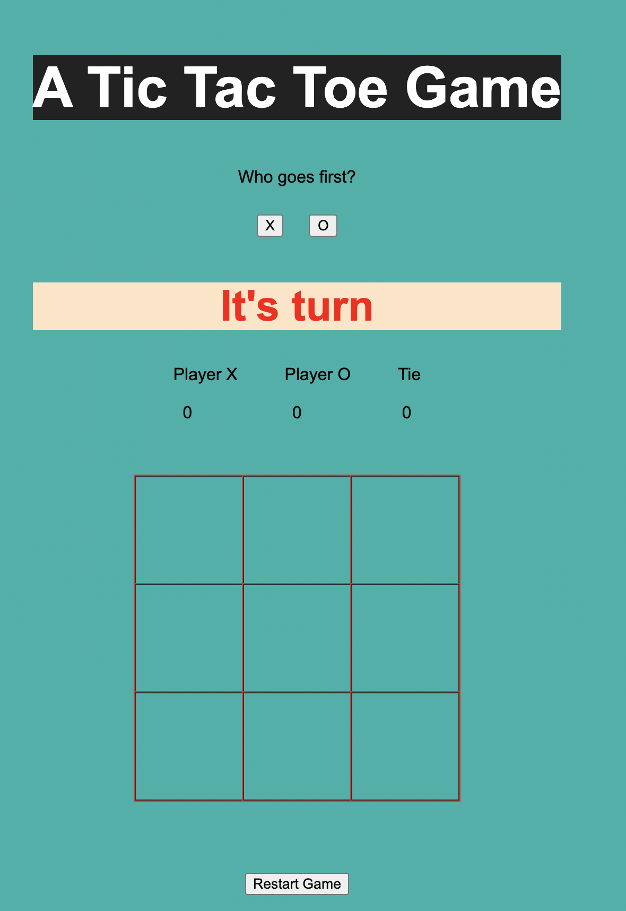
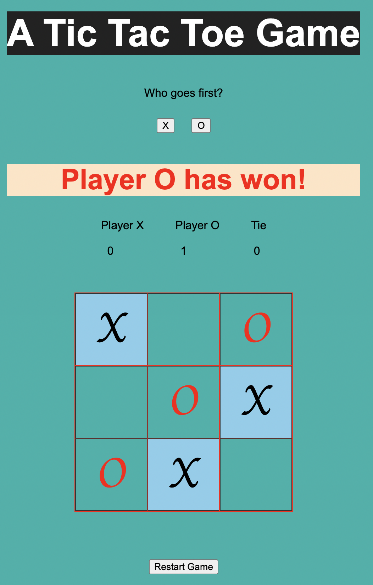
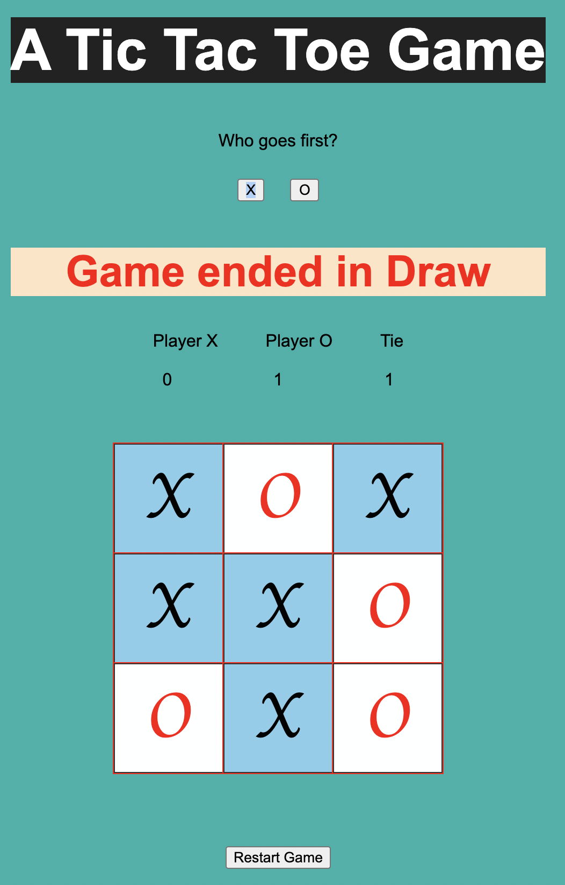

# Tic-Tac-Toe
Tic-Tac-Toe game is designed and implemented which allows 2 users to play multiple games. Following features are implemented in the game:
1. You can choose who can play first 'X' or 'O'.
2. Base on your choice when you click on square 'X' or 'O' appear on the box with Audio for the tics.
3. It will continuously check the win condition.
    - If a player wins the game, game box little twist shows somebody wins the game.
    - If the game draw, game box flash means game tie .
6. Based on the game, scores update if 'X' or 'O' wins or tie between them.
7. Reset button clear board and play multiple games without refresh page.
8. Responsive site playable from a mobile phone.

## Game UI
1. Initial screen
   
   
2. User wins
   
   
3. Draw
   

## Running Game
- Click [here](https://github.com/Bhartigupta1587/Tic-Tac-Toe) to play game

## Logic
1. There are total 8 winning conditions. 
   - I took the nested array for winning condition
   - That take the array variable and check one by one 8 winning condition and
     if match with the one of the condition true so current player is the winner
     otherwise call to change player.
2. If all the boxes tics nobody wins then its draw.

## Project structure:
- index.html : Contains a basic UI and imports the other files like style.css, script.js
- style.css: UI styles
- script.js: Game logic, events.

## Technologies
- Html: For creating UI
- CSS: For styling UI
- Javascript: For implementing game logic and event listeners.

## Tools used
- IntelliJ
-  Google Chrome Browser: For displaying the application.

## Future Enhancements

- The smart AI will try to figure out later.
- 3rd-party services.

